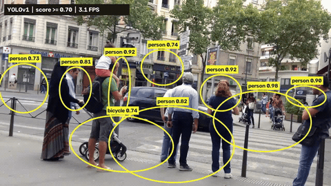
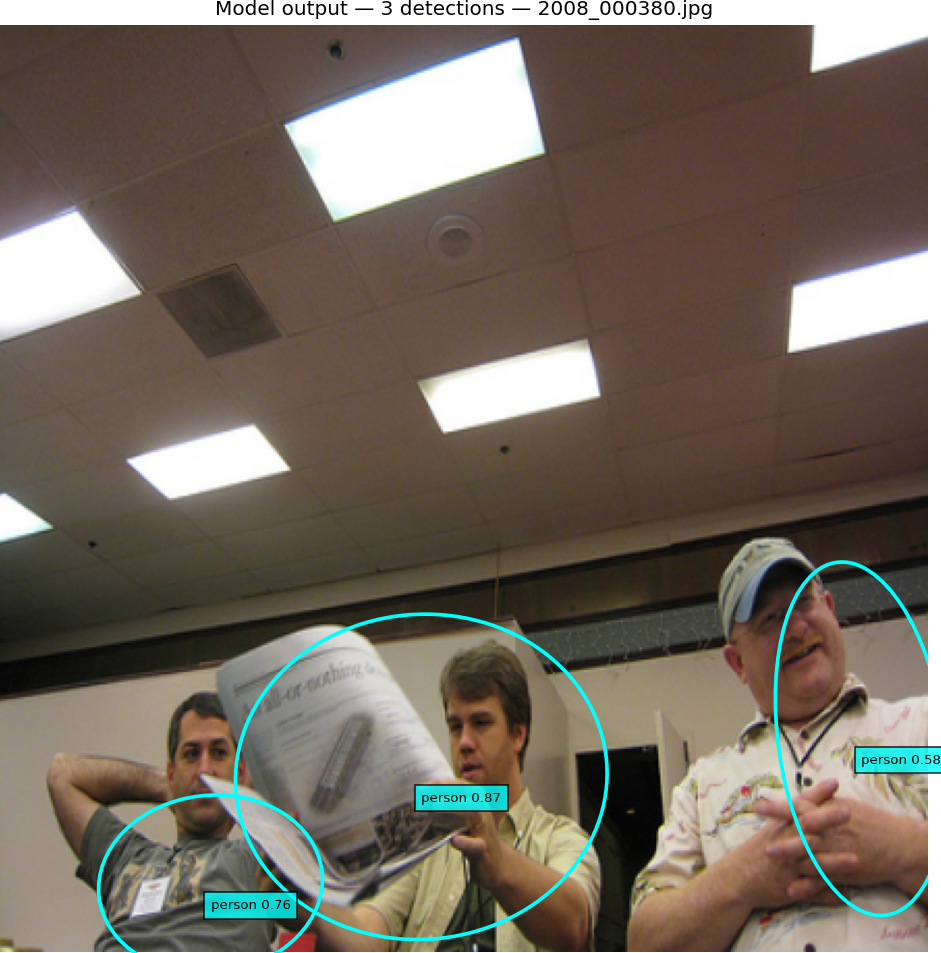
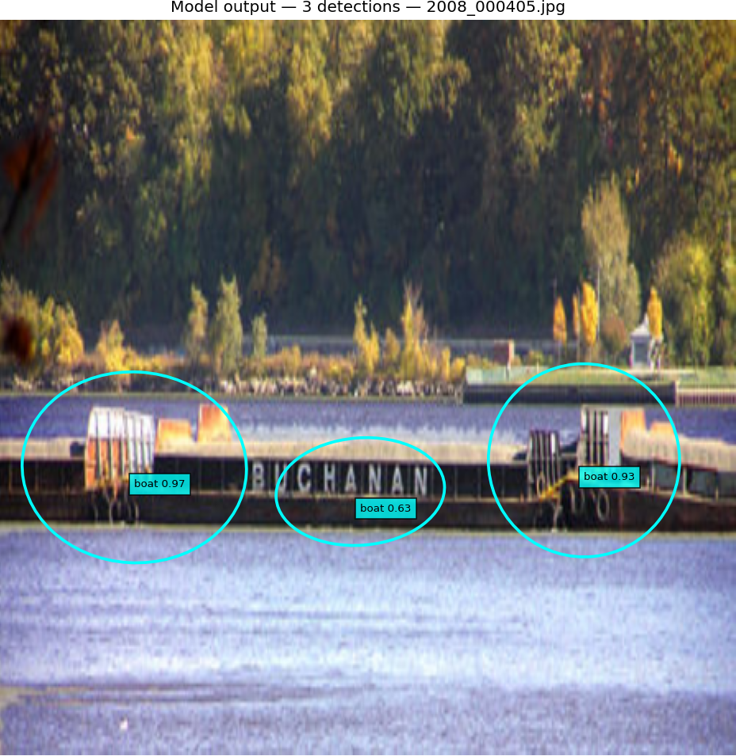
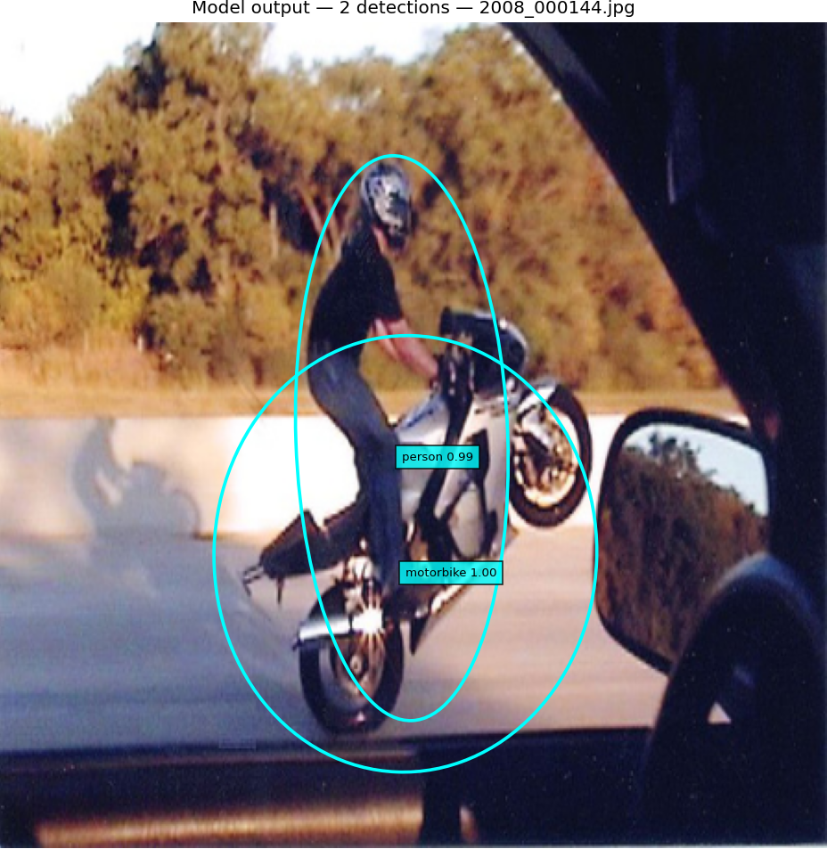
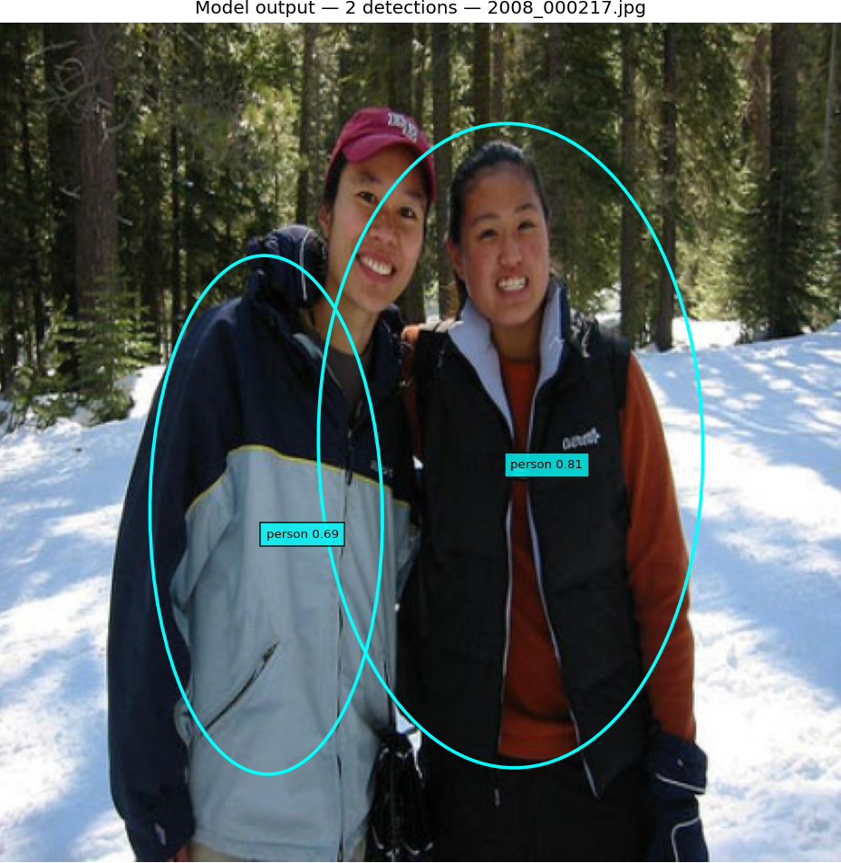

# YOLO v1 with Rotated Bounding Box Detection

## Video demo

This 7-second example shows YOLO marking people in a street scene. It only displays model scores from 0.70 to 1.00. A score is the model's estimate, not a guarantee that a detection is correct.



[Watch the full-size video](demo_video/yolo_people_demo.mp4). On an NVIDIA A16 GPU, the model processed the clip at about 22 frames per second; the original clip runs at about 30 frames per second.

The clip is an edited excerpt of [“People waiting to cross the street” by Amada44](https://commons.wikimedia.org/wiki/File:People_waiting_to_cross_the_street.webm), shared under CC BY-SA 3.0. See [demo source and attribution](demo_video/SOURCE.txt).

## Example results

This model looks at a picture and marks the objects it detects with oval outlines. The labels name each object and show the model's confidence estimate. Confidence is not a guarantee that a detection is correct.

These examples use pictures included in the model's training run. They show what the model can detect, but they are not an independent measure of how well it works on new pictures. Only the model's output is shown; reference boxes are not included.

### Three objects





The model marks three boats in the second picture. A repeat check did not confirm all three boxes as a close match, so treat this as an example of the model's output, not a verified perfect result.

### Two objects





Parts of this project—specifically the YOLO implementation—are adapted from the standard YOLOv1 implementation by Jeffrey Tan:
https://github.com/tanjeffreyz/yolo-v1

## Overview

This implementation detects 20 object classes from the VOC 2012 dataset using a 7×7 grid-based detection approach. Unlike the original YOLO, it predicts rotated ellipses by including an angle parameter, enabling detection of objects at arbitrary orientations.

The model uses a ResNet50 backbone for feature extraction and a custom detection head to output ellipses coordinates, confidence scores, class probabilities, and rotation angles.

## Key Features

- **Rotated Object Detection**: Supports detection of objects at any angle using ellipse-shaped figure.
- **Transfer Learning**: Utilizes pre-trained ResNet50 backbone with a warmup strategy for better convergence.
- **Data Augmentation**: Includes rotation augmentation (±20°) to improve robustness to oriented objects.
- **Monte Carlo IoU**: IoU calculation using point sampling for evaluation of rotated boxes.
- **Comprehensive Evaluation**: Includes validation, visualization, and detection analysis tools.
- **Modular Design**: Clean separation of model, training, validation, and utility functions.

## Differences from Original YOLO v1

| Aspect | Original YOLO v1 | This Implementation |
|--------|------------------|-------------------|
| **Backbone** | Custom convolutional network | ResNet50 (transfer learning) |
| **Bounding Boxes** | Axis-aligned rectangles | Ellipses with angle |
| **Box Parameters** | [x, y, w, h, conf] per box | [x, y, w, h, conf, sin(θ)] |
| **Training Strategy** | Full training from scratch | Transfer learning with frozen backbone warmup |
| **Loss Function** | Standard sum of squared errors | Weighted MSE including angle term |
| **IoU Computation** | Standard rectangular IoU | Monte Carlo sampling for rotated Ellipses |
| **Data Augmentation** | Minimal (random crops/scaling) | Rotation augmentation (±20°) |
| **Dataset** | Custom/COCO format | VOC 2012 (20 classes) |

## Project Structure

```
├── config.py              # Hyperparameters and configuration
├── YOLO.py                # Model architecture (YOLOv1ResNet)
├── TRAIN.py               # Training pipeline with hyperparameter search
├── LOSS.py                # Custom loss function for rotated boxes
├── VOC.py                 # VOC dataset loader and preprocessing
├── utils.py               # Utility functions (IoU, NMS, visualization)
├── validate.py            # Model evaluation and metrics computation
├── visualise.py           # Plotting and visualization tools
├── data/
│   └── VOCdevkit/
│       └── VOC2012/       # VOC 2012 dataset
└── models/
    └── yolo_v1/           # Saved model checkpoints
        └── [date]/
            └── [time]/    # Timestamped training runs
```

## Model Architecture

The model consists of:
- **Backbone**: ResNet50 (pre-trained on ImageNet)
- **Detection Head**: 4 convolutional layers followed by 2 fully connected layers
- **Output**: 7×7×32 tensor (20 classes + 2 boxes × 6 parameters each)

Each bounding box includes: [confidence, x_offset, y_offset, width, height, sin(angle)]

## Loss Function

Custom `SumSquaredErrorLoss` combining:
- **Position Loss**: MSE on x,y coordinates (weighted by λ_coord)
- **Dimension Loss**: MSE on √(width), √(height) for scale invariance
- **Confidence Loss**: MSE on confidence scores (different weights for object/no-object cells)
- **Classification Loss**: MSE on class probabilities
- **Angle Loss**: MSE on sin(angle) for rotation

## Loss Function Enhancements

This project extends the original YOLO v1 loss by adding an explicit rotation term and by handling rotated bounding boxes more directly.

### Original YOLO v1 Loss

In the original YOLO v1 formulation, the loss was:

- Localization loss for position and size:
  - `λ_coord * Σ ( (x - x̂)^2 + (y - ŷ)^2 + (√w - √ŵ)^2 + (√h - √ĥ)^2 )`
- Confidence loss:
  - `Σ_obj (C - Ĉ)^2 + λ_noobj * Σ_noobj (C - Ĉ)^2`
- Classification loss:
  - `Σ_obj Σ_c (p_c - p̂_c)^2`

This produced a single sum of squared errors over objectness, box coordinates, and class probabilities.

### New Loss Formula

In this implementation, the loss adds a dedicated angle component for rotated boxes:

- Localization + size loss (same style as YOLO v1):
  - `λ_coord * Σ ( (x - x̂)^2 + (y - ŷ)^2 + (√w - √ŵ)^2 + (√h - √ĥ)^2 )`
- Confidence loss (separate object / no-object weights):
  - `Σ_obj (C - Ĉ)^2 + λ_noobj * Σ_noobj (C - Ĉ)^2`
- Classification loss:
  - `Σ_obj Σ_c (p_c - p̂_c)^2`
- Rotation angle loss:
  - `Σ_obj (sin(θ) - sin(θ̂))^2`

Because angle is encoded as `sin(θ)`, the model can learn rotational orientation while avoiding discontinuities at ±180°. This means the new loss penalizes both mislocalized boxes and incorrect object orientation in a single, unified training objective.

### Why Monte Carlo IoU Makes Sense

This implementation uses Monte Carlo point sampling to estimate IoU for rotated boxes. That is a practical choice because:

- Rotated boxes are harder to compare with closed-form geometry than axis-aligned rectangles.
- Sampling points inside and around the boxes makes it easy to approximate intersection and union without implementing complex polygon math.
- It is flexible and works consistently for arbitrary angles and ellipsoidal approximations.

### Monte Carlo Disadvantages

There are trade-offs to this approach:

- **Approximation error**: The result depends on the number of sample points, so it can be noisy for small sample counts.
- **Performance cost**: Sampling thousands of points can be slower than exact geometry, especially during evaluation.
- **Less deterministic**: Unless the random seed is fixed, estimates may vary slightly between runs.

Overall, Monte Carlo IoU is a sensible choice for a rotated detection problem because it simplifies implementation and supports arbitrary orientation, but it should be used with enough samples and care to keep estimates stable.

## Evaluation Metrics

- **Precision/Recall**: Standard object detection metrics
- **mAP**: Mean Average Precision across classes
- **Detection Analysis**: True positives, false positives, false negatives per class

## Performance Results

The model was evaluated on the VOC 2012 dataset. Below are the key performance metrics:

### Test Data Performance
- **Precision**: 0.632
- **Recall**: 0.579
- **F1 Score**: 0.604
- **mAP**: 0.478

### Training Data Performance
- **Precision**: 0.912
- **Recall**: 0.843
- **F1 Score**: 0.876
- **mAP**: 0.844

**Note**: The results indicate some overfitting, as performance on training data is significantly higher than on test data. This is common in deep learning models and could be addressed through regularization techniques, additional data augmentation, or early stopping.

## Usage

### Data Preparation
The project expects the VOC 2012 dataset structure. Ensure your data is organized as shown in the project structure above.

### Training
Run the training script to train the model:
```bash
python TRAIN.py
```
This will perform hyperparameter search and train the model with the best configuration found.

### Validation
Evaluate the trained model on the test set:
```bash
python validate.py
```
This computes detection metrics.

### Visualization
Visualize predictions and ground truth:
```bash
python visualise.py
```
This creates images showing the model's predictions alongside the labeled objects.
